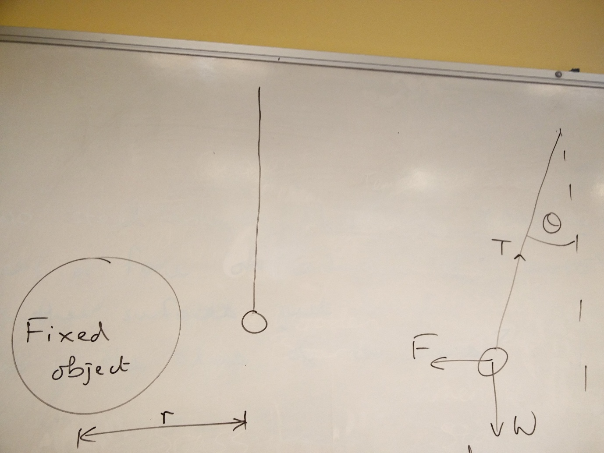
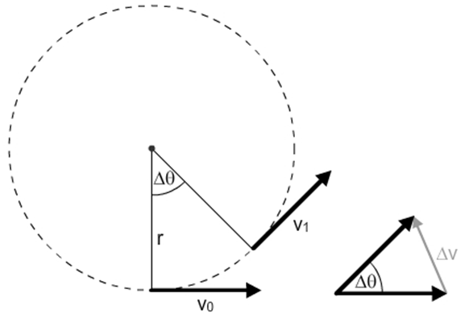
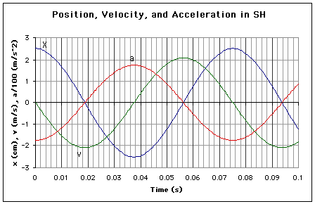
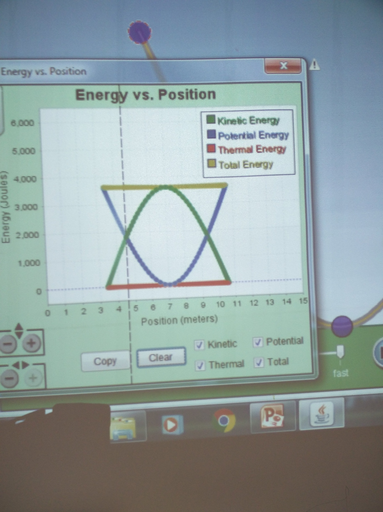

**Physics A2 Notes**

**Capacitance**

In our experiment with a vanda graph generator we moved the ball and the VDG a
certain distance and measured the time for 10 discharges. We then changed the
distance and he time changes. As time goes on, the charge builds up in a liner
way against charge until a point where it discharges. As the distance increases,
the time (therefore charge) has to be greater before a discharge.

The ratio of charge to potential on an electrically charged, isolated conductor.

C = Q/V and is measured in Faradays. Charge stored over change in potent

Insulators do not conduct electricity but why we put a capacitor into a circuit,
a current flows through the circuit and then stops. This is because the charges
of the plates on the capacitor are not equal to the charge on the battery.
Electrons are attracted to the positive terminal of the battery and flow towards
it. This leaves one plate positive. On the other plate, they are repelled by the
charge on the battery pushing electrons to the plate of the capacitor, this
makes it negative. But when the charges are equal, no current flows.

**Charging The Capacitor**

The voltage across the capacitor + the voltage across the resistor = the
terminal voltage

$$
v = v_{0}(1 - e^{- \frac{t}{\text{rc}}})
$$

$$
If\ y = e^{\text{ax}} \rightarrow \ln\left( y \right) = ax
$$

$$
\frac{v}{v_{0}} = 1 - e^{- \frac{t}{\text{RC}}}
$$

$$
\ln{(\frac{v}{v_{0}} - 1)} = \frac{t}{\text{RC}}
$$

$$
\ln\frac{v - v_{0}}{v_{0}} = \frac{t}{\text{RC}}
$$

**RC Circuits**

When we charge the capacitor, the potential difference across the capacitor
increases to a maximum value. Then when decreasing, the speed depends on the
resistor value. The more resistance, the more time it takes to decharge.

$$
v = V_{o}e^{- \frac{t}{\text{Rc}}}
$$

$$
\frac{v}{v_{o}} = e^{- \frac{t}{\text{Rc}}}
$$

$$
\ln{\frac{v}{v_{o}} = \  - \frac{t}{\text{Rc}}}
$$

$$
\ln v - \ln v_{o} = \  - RC^{- 1}
$$

$$
\ln V = \  - \frac{1}{\text{Rc}}t + \ln v_{o}
$$

So $$V\left( t \right) = V_{o}e^{- \frac{t}{\text{rc}}}$$ where t is a variable
and rc are constants

RC is significant. We can derive the units like this:

$$
\text{RC}
$$

$$
\frac{V}{I}Q = \frac{V}{I}\frac{Q}{V} = \frac{Q}{I} = T
$$

So the units for RC is time

This is the time for the circuit to get to 1/e of charge

**Total energy in a capacitor**

$$
E = \frac{1}{2}CV^{2}
$$

So, for example, if I had $$220\ \mu F$$ capacitor and a 6 volts. How much
energy is stored? 4mJ

$$
E = VIT
$$

$$
Q = IT\therefore E = VQ
$$

$$
C = \frac{Q}{V}
$$

$$
c \times v^{2}
$$

The Work done by the battery is always twice as much as the work done by the
capacitor.

$$
C \propto Area\ of\ overlap
$$

$$
C \propto Relative\ permittivity,\ Er
$$

$$
C \propto \frac{1}{\text{Distance\ between\ plates}}
$$

So:

$$
C = \frac{\epsilon_{0}\epsilon_{r}A}{d}
$$

$$\epsilon_{0} = 8.85 \times 10^{- 12}Fm^{- 1}\$$And is the permeability of free
space.

$$\epsilon_{r}\$$is a relative permeability and if the factor by which
$$\epsilon_{0}$$ is increased.

*Factors affecting capacitance*

A capacitor consists of 2 plates separated by an insulator called the
dielectric. We can use a capacitance meter to investigate the factors affecting
the capacitance.

E.G. 2 aluminium plates, each 30cm by 30cm, are held 1mm by a dielectric of
relative permeability 5. Calculate the capacitance.

$$
C = \frac{8.85 \times 10^{- 12} \times 5 \times {0.3}^{2}}{1 \times 10^{- 3}} = 3.98 \times 10^{- 9}
$$

*Gravity*

Calculating the acceleration of the moon.

The moon has an orbital radius of 385000km. and takes 27.3 days to orbit.

This is 2358720 seconds

$$
\omega = \frac{2\pi}{2358720}
$$

$$
a = \omega^{2}r = 2.73 \times 10^{- 3}\text{\ m}s^{- 2}
$$

We first find the angular velocity using the equation $$\omega =
\frac{\theta}{t}$$. We then use that to find the acceleration of the moon using
$$a = \omega^{2}r$$

The radius of the earth 6400km

The gravity on the surface of the earth is 3600 times stronger than the force
acting on the moon and is 60 times closer to the centre of the earth than the
moon. So the relation is that gravity is and inverse squared force.

Every mass attracts every other mass with a gravitational force that is
proportional to the product of the masses and it is inversely proportional to
the square of the distance between their centres of mass.

$$
F \propto \frac{m_{1}m_{2}}{r^{2}}
$$

$$
F = \  - \frac{Gm_{1}m_{2}}{r^{2}}
$$

Where G is the universal gravitational constant = $$6.67 \times 10^{-
11}Nm^{2}kg^{- 2}$$

Two steel spheres of mass 8000kg each exert a force on each other of $$4 \times
10^{- 5}N$$ when their surfaces touch. What is the radius of the spheres?

$$
4 \times 10^{- 5} = \  - \frac{6.67 \times 10^{- 11} \times 8000^{2}}{r^{2}}
$$

$$
r = \frac{1}{2}\sqrt{\frac{6.67 \times 10^{- 11} \times 8000^{2}}{4 \times 10^{- 5}}}
$$

$$
F = \ T\sin\theta
$$

$$
W = T\cos\theta
$$

$$
\frac{F}{W} = \tan\theta
$$

$$
F = W\tan\theta
$$

**Where the pull to the moon is equal to the pull to the earth**

The gravitational field strength is the gravitational force acting on a unit
mass placed at that point.

$$
g = \frac{F}{m}
$$

$$
g = \frac{\left( - \right)\text{GM}}{r^{2}}
$$

A gravity field is a field of negative energy. This is why, when moving away
from the source, you do work against the field to move away and work with to
move closer.

The Gravitational potential at a point in a field, is defined as, the work done
in moving unit mass from infinity to that point.

$$
V(r) = \int f
$$

$$
V(r) = \int_{\infty}^{r}{- \frac{Gm_{1}}{r^{2}}}\text{dr}
$$

$$
= \ \int_{\infty}^{r}{- Gm_{1}r^{- 2}}\text{dr}
$$

$$
= \left\lbrack - \frac{Gm_{1}r^{- 1}}{r} \right\rbrack - \left\lbrack - \frac{Gm_{1}r^{- 1}}{\infty} \right\rbrack
$$

$$
V(r) = - \frac{Gm_{1}}{r}
$$

Equipotential surfaces are places where the potential is the same. The
gravitational field is perpendicular to the equipotential surface. No work done
moving around an equipotential surface.

Change in potential = $$\Delta V(r)$$

Work Done = $$\Delta V\left( r \right)m$$

Work Done = $$GMm(\frac{1}{r_{1}} - \frac{1}{r_{2}})$$

A Geostationary satellite is a satellite that has an identical orbital period to
the planet it is orbiting.

Linking time of orbit and radius of orbit:

$$
F = \frac{GM_{1}M_{2}}{r^{2}}
$$

$$
\frac{mv^{2}}{r} = \frac{GM_{1}M_{2}}{r^{2}}
$$

$$
v^{2} = \frac{\text{GM}}{r}
$$

$$
\frac{\left( 2\pi r \right)^{2}}{t^{2}} = \frac{\text{GM}}{r}
$$

$$
\frac{4\pi^{2}r^{2}}{t^{2}} = \frac{\text{GM}}{r}
$$

$$
\frac{r^{3}}{t^{2}} = \frac{\text{GM}}{4\pi^{2}}
$$

Uses for geostationary orbits:

TV satellites use geostationary stationary orbits so that the signal is not
lost. Also GPS satellites use Geostationary orbits so that they can be used to
provide accurate positions.

Polar satellites can be used for spying, meteorology, Mapping.

**Circular motion**

$$
\omega = angular\ velocity = \frac{\theta}{t}
$$

$$
\theta = \frac{s}{r}
$$

$$
v = \frac{s}{t}\therefore v = \frac{\text{rθ}}{t} = r\omega
$$

$$
T = time\ period = \frac{2\pi r}{t} = \frac{2\pi}{\omega}
$$

$$
a = \frac{\Delta v}{\Delta t} = r\omega^{2} = \frac{v^{2}}{r}
$$

$$
F = ma = \frac{mv^{2}}{r} = m\text{rω}^{2}
$$

*Simple Harmonic Motion*

There are two types of simple harmonic motion: mass on a spring and pendulum. In
both these cases, there is a restorative force which acts towards the
equilibrium position. The restoring force is provided by, in the case of the
mass on a spring, it’s the force of the spring, in the case of the pendulum, it
is gravity. The restoring force in SHM is always directly proportional to the
displacement and in the opposite direction to displacement.

$$
\mathbf{x = A}\cos\mathbf{(\omega t)}\ where\ \omega = \frac{2\pi}{T}
$$

$$
T = 2\pi\sqrt{\frac{l}{g}}
$$

$$
\mathbf{v = - \omega A\ sin\ (\omega t)}
$$

$$
\mathbf{a = \  -}\mathbf{\omega}^{\mathbf{2}}\mathbf{A\ cos\ (\omega t)}
$$

Now, if we look at the last part of this equation ($$A\cos{(\omega t)}$$), we
see it is the same as x so:

$$
\mathbf{a = \  -}\mathbf{\omega}^{\mathbf{2}}\mathbf{x}
$$

Another equation for v is:

$$
v = \pm \ 2\pi f\sqrt{A^{2} - x^{2}}
$$

*Damped SHM*

Damping is the inclusion of a force in SMT that opposes the motion of
oscillation. This can be provided in a number of ways

-   Heavily Damped – It takes a long time to return to equilibrium

-   Underdamped – Some vibrations getting smaller

-   Critical Damping – Quickly returns to equilibrium with no further vibration
